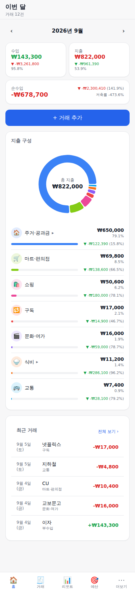
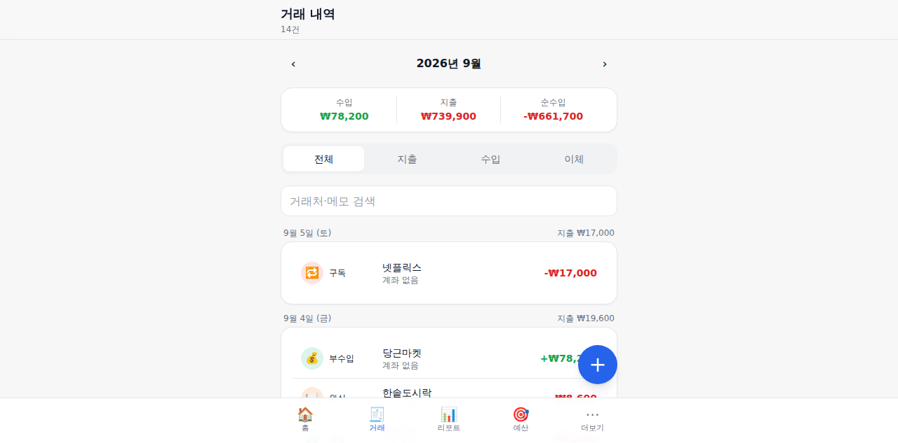
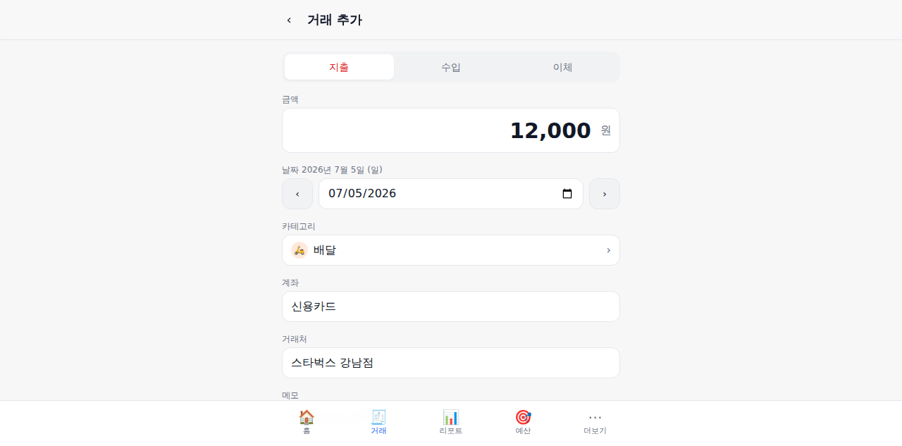
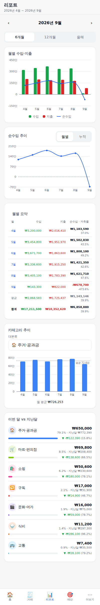
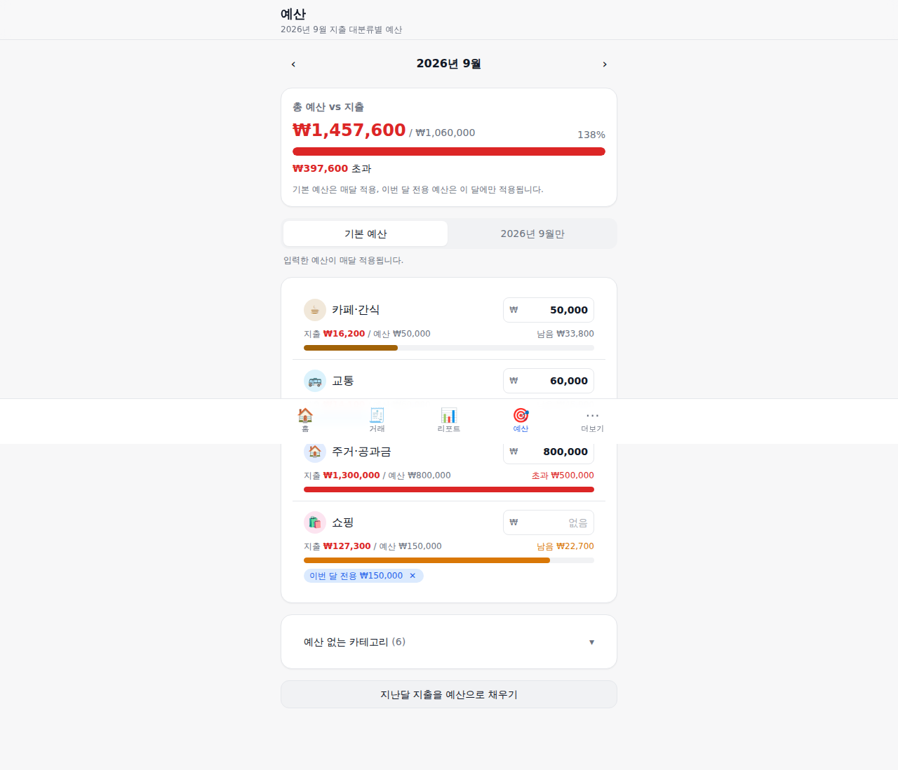
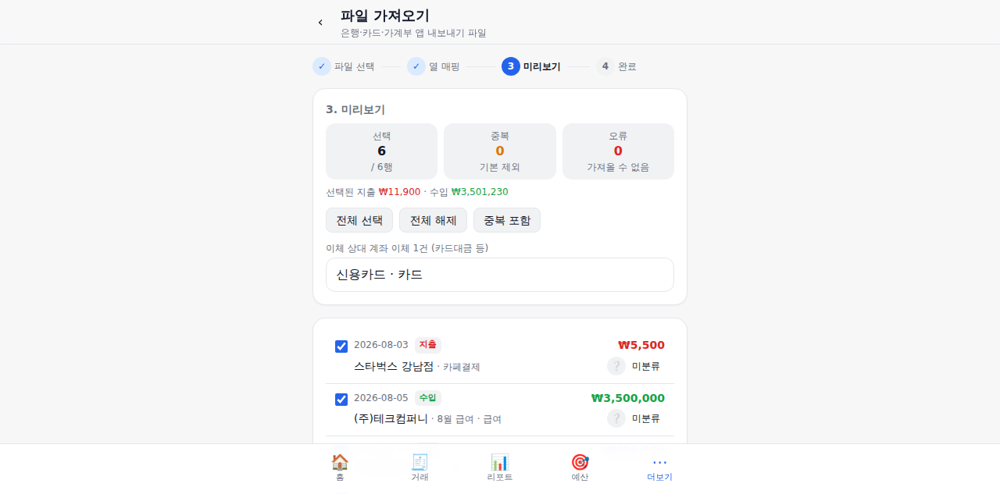

# 가계부 앱 제작 요약 정리본

작성일: 2026-09-05 · 브랜치: `claude/household-budget-app-f3snag`

## 1. 한눈에 보기

| 항목 | 내용 |
|---|---|
| 무엇을 | 월별 **수입·지출·순수입**과 **카테고리별 지출 비율**을 보여주는 가계부 웹앱(PWA) |
| 어떻게 | 서버 없이 브라우저 IndexedDB에 저장, JSON 백업·동기화 폴더 자동 백업으로 기기 간 이동 |
| 입력 | 수동 입력 + 은행·카드·뱅크샐러드 내보내기 파일(CSV/XLSX) 가져오기, 가맹점 키워드 자동 분류(규칙 162개) |
| 추가 기능 | 연간 추세 리포트, 카테고리별 월 예산, 반복 거래 자동 등록, 계좌·자산 관리 |
| 규모 | TypeScript/TSX 130개 파일 · 약 13,000줄 · 커밋 45개 · 단위·화면 테스트 183개 · 브라우저 E2E 검사 21개 |

사용자 결정 사항(질문 → 답): 플랫폼 **PWA 웹앱**, 저장 **기기 내 로컬 + 백업 파일 동기화**, 연동 **수동 입력 + 파일 가져오기**, 추가 기능 **4개 모두**.

## 2. 화면과 기능

| 화면 | 구현 내용 |
|---|---|
| 홈 (이번 달) | 수입·지출·순수입 카드(전월 대비 ▲▼, 저축률), 지출 구성 도넛 + 대분류별 금액·비율·전월 대비, 소분류 드릴다운, 예산 요약, 최근 거래, 빈 달 안내 |
| 거래 | 월 이동, 월 요약, 지출/수입/이체 필터, 거래처·메모 검색, 날짜별 그룹(일별 지출 합계), 환불·가져옴·반복 태그 |
| 거래 입력 | 지출/수입/이체 3탭, 천단위 금액 입력, 날짜 ±1일, 대분류→소분류 피커, 계좌(이체는 출금→입금), 거래처 자동완성, **거래처 키워드로 카테고리 추천**, 환불 토글, 저장 후 계속 입력, 삭제 |
| 리포트 | 6개월/12개월/올해 수입 vs 지출 막대 + 순수입 선, 누적 순수입, 월별 표(평균·합계·저축률), 카테고리 추이, 이번 달 vs 지난달 비교 |
| 예산 | 대분류별 기본 예산 / 이번 달 전용 예산, 사용률 막대(정상·주의·초과), 지난달 지출로 채우기 |
| 계좌 | 순자산, 계좌별 잔액(초기 잔액 + 수입 − 지출 ± 이체), 유형·색상, 보관·삭제, 계좌별 최근 거래, 이체 바로가기 |
| 카테고리 | 지출/수입 대분류 14/7개·소분류 68/15개 기본 제공, 추가·수정·정렬·보관·삭제 |
| 반복 거래 | 매월 N일(말일 보정) 규칙, 시작·종료 월, 활성 토글, 발생일이 지나면 앱 시작 시 자동 생성(멱등), 지금 생성 |
| 파일 가져오기 | 4단계 마법사(파일 → 열 매핑 → 미리보기 → 완료), 출처 자동 감지 12개 프로필, EUC-KR/UTF-8/UTF-16·HTML표(.xls) 대응, 자동 분류·중복 감지·이체 상대 계좌 지정, 매핑 저장·재사용, "이 거래처는 항상 이 카테고리" 학습 |
| 백업·복원 | JSON 백업·CSV 내려받기, 복원(덮어쓰기/병합), 동기화 폴더 자동 백업(Chromium), 저장 공간 현황·영구 저장 요청 |
| 설정 | 시스템/라이트/다크 테마, 홈 화면 설치 안내(iOS 포함), 기본 분류 규칙 복원, 샘플 데이터, 전체 삭제 |
| PWA | 매니페스트·아이콘·오프라인 캐시, 새 버전 알림, 무거운 화면 지연 로딩 |








## 3. 은행·카드 자동 연동 검토 결과

사업자등록이 없는 개인 앱은 국내 실시간 자동 연동을 쓸 수 없다는 결론입니다.

| 방식 | 개인 가능? | 이유 |
|---|---|---|
| 오픈뱅킹 API(운영) | ✗ | 이용기관(핀테크기업·전자금융업자) 등록, 사업자등록증, 보안점검 필요 |
| 마이데이터 | ✗ | 자본금 5억 이상, 금융위 허가(신용정보법 §6) |
| CODEF 등 유료 스크래핑 API | △ | 1개월 데모만 개인 가능, 정식은 사업자등록증 필수, 인증정보 위임 보관 리스크 |
| 해외 어그리게이터(Plaid 등) | ✗ | 한국 미지원 |
| **파일 가져오기** | **○** | 뱅크샐러드·토스뱅크·카카오뱅크·KB국민은행·삼성/신한/KB국민/현대카드 모두 엑셀·CSV 제공 |
| Android 알림/SMS 파싱 | △ | 네이티브 앱 필요, iOS 불가 — 향후 확장 옵션 |

상세 근거·출처와 파일별 컬럼 구조는 [`research-brief.md`](research-brief.md) 2절과 [`../src/features/import/FORMATS.md`](../src/features/import/FORMATS.md)에 있습니다.

## 4. 참고한 기존 앱과 채택한 패턴

- **Actual Budget**(MIT): 이체를 별도 타입으로 두고 집계에서 제외, 카테고리 2단계, CSV 열 매핑·부호 반전·중복 제거 → 그대로 채택.
- **뱅크샐러드·편한가계부**: 수입/지출/이체 3탭 입력, 결제수단(계좌) 연결, 뱅크샐러드 엑셀 10열 구조를 가져오기 표준 입력으로 채택.
- **토스·GnuCash·Cashew**: 도넛 + 카테고리 리스트(금액·%·전월 대비) + 드릴다운.
- 피한 것: 고정 열 순서 CSV(HomeBank), 평면 카테고리(Firefly III), 이체를 특수 카테고리로 흉내(위플).
- 국내 앱·통계청 12대 지출 항목을 참고해 기본 카테고리와 자동 분류 규칙을 만들었습니다.

## 5. 설계 요약

- **데이터 모델**: Transaction(expense/income/transfer, 정수 원, `isRefund`), Category(대분류/소분류), Account, Budget(`*`=기본, `YYYY-MM`=해당 월), RecurringRule, ClassifyRule, Setting. Dexie(IndexedDB) v1 스키마.
- **집계 규칙**: 이체 제외, 환불 차감, 대분류 비율 = 대분류 순지출 / 총 순지출, 소분류 비율 = 소분류 / 대분류, 미분류는 가상 버킷, 월은 `YYYY-MM` 문자열(달력월).
- **구조**: `domain/`(순수 계산, 전부 단위 테스트) → `db/repo.ts`(검증·CRUD·시딩·백업) → `hooks/`(useLiveQuery) → `features/`(화면). 차트는 Recharts 3, 스타일은 Tailwind 4 토큰(라이트/다크).
- **스택**: Vite 8 · React 19.2 · TypeScript · react-router 8 · Dexie 4 · Recharts 3 · date-fns 4 · PapaParse · SheetJS 0.20.3 · vite-plugin-pwa · Vitest 5.

## 6. 검증

| 종류 | 결과 |
|---|---|
| 타입체크·린트·빌드 | 통과 (`tsc -b`, oxlint, `vite build` + 서비스워커 생성) |
| 단위·화면 테스트 | **183개 통과** (도메인 계산, 저장소, 기본 카테고리 일관성, 가져오기 파서 38개, 화면 렌더 테스트) — 부하 상황 3회 연속 통과 |
| 브라우저 E2E (agent-browser, 실제 Chromium) | **21개 검사 통과**: 홈·탭 이동·샘플 시딩·JS 오류 없음 → 거래 입력(키워드 추천 적용) → 목록 표시·DB 저장 확인 → 리포트·예산 화면 → 토스 CSV 가져오기(출처 감지·자동 분류·6건 추가) → 재업로드 중복 감지 |
| 각 기능 에이전트의 브라우저 검증 | 라이트/다크 스크린샷과 DB 상태 대조로 확인 (docs/screenshots) |
| 적대적 코드 리뷰 | 3개 관점(도메인·저장소 / 화면 로직 / 백업·PWA) 19건 확인·수정(7절) + 가져오기 전용 리뷰(8절) |

## 7. 코드 리뷰 결과

3개 관점(도메인·저장소 / 화면 로직 / 백업·PWA) 리뷰어가 찾은 결함을 관점별 검증 에이전트가 반박 시도 → **19건 확인(CONFIRMED), 0건 반박** → 전부 수정하고 회귀 테스트를 추가했습니다(테스트 168 → 178개).

| 심각도 | 확인된 결함 | 조치 |
|---|---|---|
| 높음 | 예산 인라인 입력에서 Esc를 눌러도 값이 저장됨 | 취소 플래그로 blur 저장 차단, 테스트 추가 |
| 높음 | 반복 거래로 생성된 거래의 날짜를 다른 달로 옮기면 그 달이 중복 생성되고 다음 달이 빠짐 | 발생 월(`recurringMonth`)을 별도 저장해 멱등 기준으로 사용 |
| 중간 | 환불로 음수가 된 카테고리 때문에 다른 카테고리 비율이 100%를 초과 | 비율 분모를 양수 합계로 계산(도넛 포함) |
| 중간 | 계좌 삭제 후 이체 반복 규칙이 상대 계좌 없이 계속 생성돼 순자산이 매달 줄어듦 | 이체 규칙 자동 비활성화 + 생성 전 검증 |
| 중간 | 짧은 영문 키워드(cu, kt, pub)가 CULTURELAND·COCKTAIL·PUBG 같은 단어 일부에 매칭 | 3자 이하 영문 키워드는 단어 경계 요구 |
| 중간 | 보관된 카테고리의 예산이 총 예산에 포함되지만 지울 행이 없음 | 예산·홈 화면에서 보관 카테고리 예산 제외 |
| 중간 | 껐다 켠 반복 규칙이 꺼져 있던 달을 소급 생성 | 재활성화 시 이번 달부터 이어감, 안내 문구 수정 |
| 중간 | 복원이 동기화 폴더의 최신·당일 백업을 즉시 덮어써 복원 전 데이터가 사라짐 | 복원 직전 스냅샷을 폴더에 저장(폴더 없으면 내려받기) |
| 중간 | 서비스워커 업데이트 후 옛 청크를 못 불러오면 빈 화면 | 청크 로드 실패 시 1회 새로고침하는 에러 경계 |
| 중간 | 백업 복원이 payee/memo/month 없는 행을 그대로 받아 월별 화면에서 사라지거나 검색이 죽음 | 복원 행 정규화(month 재계산, 기본값, 이체 검증) |
| 낮음 | 홈 예산 '전체 보기'가 선택 월을 잃음 / 수입 반환을 '환불'로 표기 / 리포트 카테고리 추이 기본값이 보관 카테고리 | 링크에 월 유지, 라벨 분기, 표시 가능한 카테고리로 제한 |
| 낮음 | 테마가 localStorage·설정 테이블에 이중 저장되어 백업·초기화와 어긋남 | localStorage 단일화 |
| 낮음 | CSV 내보내기에서 `=`·`+`·`-`·`@`로 시작하는 셀이 수식으로 실행될 수 있음 | 작은따옴표로 무력화 |
| 낮음 | 엑셀 시리얼 날짜의 시각 소수부를 반올림해 오후 시각이 다음 날로 밀림 | 내림 처리 |
| 낮음 | 카테고리 삭제가 반복 규칙에 전파되지 않음 / 반복 규칙 수정 시 검증 없음 / 복원 시 저장된 month 값을 신뢰 | 규칙 카테고리 해제, 수정 시 검증, date 기준 month 재계산 |

가져오기(CSV/XLSX) 전용 리뷰는 별도로 진행했으며 결과는 아래 8절에 이어집니다.

## 8. 가져오기 리뷰 결과

파일 가져오기(파서·프로필·마법사) 전용 리뷰어의 결과를 검증 에이전트가 반박 시도 → **10건 확인, 1건 반박, 1건 불확실** → 확인 10건과 불확실 1건 모두 수정하고 회귀 테스트 5개를 추가했습니다(테스트 178 → 183개).

| 심각도 | 확인된 결함 | 조치 |
|---|---|---|
| 높음 | 출처를 못 알아본 카드 명세서(승인금액·가맹점명, 입출금·유형 열 없음)가 전부 **수입**으로 들어감 | 카드 명세서 형태를 감지해 양수 금액을 지출로, 기본 계좌를 카드로 |
| 중간 | 뱅크샐러드 '기타' 소분류·소분류 없는 행이 엉뚱한 카테고리로 매핑(전역 소분류 우선 검색) | 대분류를 먼저 확정하고 그 자식에서만 소분류 검색, 기타/빈 값은 대분류 사용 |
| 중간 | 엑셀 CSV 재저장 시 생기는 지수 표기 금액('1.2345E+6')이 1원으로 파싱 | 지수 표기 해석, 통화 외 영문자 포함 시 인식 불가 처리 |
| 중간 | 열 매핑 단계에서 프로필을 바꿔도 이전 행의 선택·카테고리 지정이 남음 | 프로필 변경 시 초기화, 종류가 다른 지정값 무시 |
| 중간 | 엑셀 시리얼 날짜 반올림(공통 리뷰와 동일) | 내림 처리 |
| 낮음 | 기존 거래와의 중복 조회가 끝나기 전에 가져오기를 눌러 중복이 들어감 | 조회 완료 전 버튼 비활성('중복 확인 중…') |
| 낮음 | 잘못된 바이트 하나 때문에 파일 전체가 EUC-KR로 읽혀 깨짐 | UTF-8/EUC-KR 두 방식으로 읽어 치환 문자가 적은 쪽 선택 |
| 낮음 | 행 수가 많은 요약 시트('뱅샐현황' 등)를 거래 시트로 선택 | 거래 헤더(날짜·금액)가 있는 시트를 우선 |
| 낮음 | 은행 프로필에서 거래처와 메모가 같은 '적요' 열을 가리킴 | 메모 열은 거래처 열을 제외하고 선택 |
| 낮음 | 상대 계좌 없는 이체가 '오류'로 조용히 빠지면서 가져오기 건수에는 포함 | 선택 대상에서 제외하고 완료 화면에 '이체 건너뜀 N건' 표시 |
| 불확실 | 조회 조건 행('거래구분·입출금구분·정렬')을 헤더로 오인할 수 있음 | 날짜 열이 있는 행을 헤더로 우선 선택 |

반박된 1건: 취소 승인 행을 환불(음수 지출)로 저장하는 동작은 원본에 취소 행이 별도로 있을 때만 적용되므로 의도대로 동작.

## 9. 개발 도구 적용 (요청 사항)

- **Context7**: `.mcp.json`에 MCP 서버 등록(`resolve-library-id`·`query-docs`, API 키 선택). Vite 8·react-router 8·Recharts 3·Vitest 5·Tailwind 4·Dexie 4·SheetJS·vite-plugin-pwa 문서를 Context7로 확인하며 구현했습니다.
- **agent-browser**: `.mcp.json` MCP 서버 + `scripts/e2e-smoke.sh`(`npm run e2e:smoke`). 실제 Chromium에서 21개 검사를 수행하고 단계별 스크린샷을 남깁니다. 사용법은 [`dev-tooling.md`](dev-tooling.md).

## 10. 사용 방법

```bash
npm install && npm run dev     # http://localhost:5173
npm run build                  # dist/ → HTTPS 정적 호스팅에 배포하면 PWA 설치 가능
```
- 처음 실행 시 기본 카테고리·분류 규칙·계좌(현금/은행/신용카드)가 자동 생성됩니다.
- 더보기 → 파일 가져오기에서 은행·카드·뱅크샐러드 파일을 올리면 출처를 감지해 매핑·미리보기 후 저장합니다.
- 더보기 → 백업·복원에서 JSON 백업을 내려받거나 동기화 폴더(Google Drive·iCloud 등)를 지정해 자동 백업합니다. 다른 기기에서는 같은 파일로 복원합니다.

## 11. 한계와 다음 단계

- 급여일 기준 월(예: 25일 시작), 분할 거래, 카드 할부의 청구월 분산, 통계 제외 플래그는 미구현.
- 암호가 걸린 엑셀(토스뱅크·카카오뱅크·현대카드)은 브라우저에서 열 수 없어 암호 해제 후 재저장이 필요.
- 편한가계부 한글 헤더와 토스 앱(비은행) 내보내기 형식은 미검증(관대한 매칭 + 수동 매핑으로 대응).
- 자동 백업 폴더는 Chromium 데스크톱 전용(File System Access API).
- 조사 결과의 교차 검증(반박 단계)은 세션 사용량 한도로 실행하지 못했습니다(출처는 문서에 기록).
- 향후 옵션: Android 알림 파싱 컴패니언 앱, 이메일 첨부 자동 수집, 달력 뷰, 고정지출 뷰.

## 12. 작업 기록

1. 리서치(6개 주제 병렬 조사) + 사용자 결정 질문 → 스택·설계 확정
2. 코어(도메인·DB·저장소·앱 셸·PWA·도구 설정) 직접 구현, 테스트
3. 기능 5개를 격리된 worktree 에이전트가 병렬 구현(각자 브라우저 검증) → 순차 병합·공용화 리팩터
4. 부하 플레이크 수정, 지연 로딩, 스모크 시나리오 확장(21개 검사)
5. 적대적 코드 리뷰 → 확인된 결함 수정 → 정리본 작성 → 푸시
